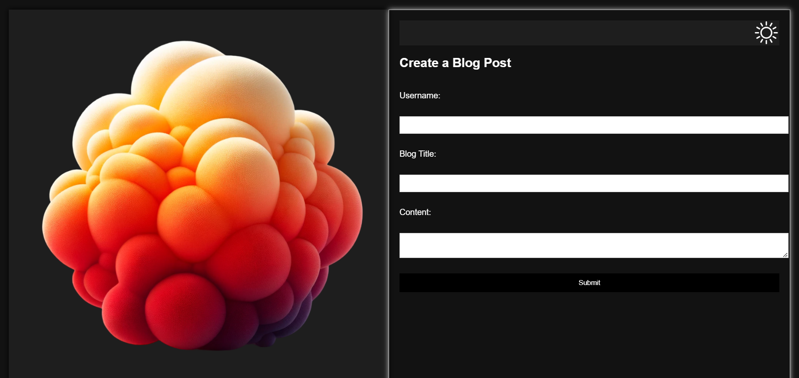
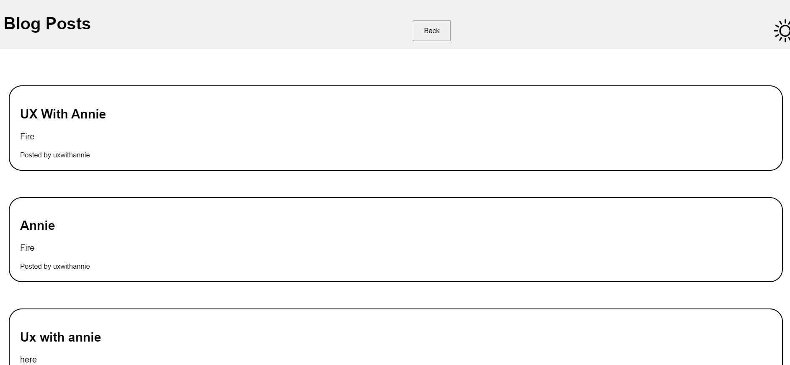
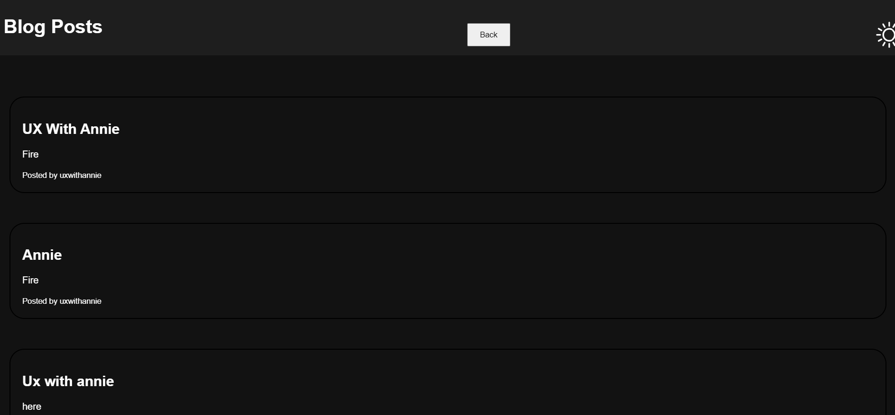

# JavaScript Challenge: Personal Blog

## Description
This challenge involves creating a two-page website where users can input and view blog posts. It serves as an excellent practice for manipulating the Document Object Model (DOM) and utilizing local storage in JavaScript. This project not only enhances frontend development skills but also provides a platform to showcase personal thoughts and experiences in a blog format.

## Challenge
### User Story
AS A marketing student,  
I WANT a personal blog,  
SO THAT I can showcase my thoughts and experiences.

### Acceptance Criteria
- **GIVEN** a personal blog  
  - **WHEN** I load the app, **THEN** I am presented with the landing page containing a form with labels and inputs for username, blog title, and blog content.
  - **WHEN** I submit the form, **THEN** blog post data is stored to localStorage.
  - **WHEN** the form submits, **THEN** I am redirected to the posts page. 
  - **WHEN** I try to submit a form without a username, title, or content, **THEN** I am presented with a message that prompts me to complete the form. 
  - **WHEN** I view the posts page, **THEN** I am presented with a header, with a light mode/dark mode toggle, and a "Back" button. 
  - **WHEN** I click the light mode/dark mode toggle, **THEN** the page content's styles update to reflect the selection. 
  - **WHEN** I click the "Back" button, **THEN** I am redirected back to the landing page where I can input more blog entries. 
  - **WHEN** I view the main content, **THEN** I am presented with a list of blog posts that are pulled from localStorage. 
  - **WHEN** I view localStorage, **THEN** I am presented with a JSON array of blog post objects, each including the post author's username, title of the post, and post's content. 
  - **WHEN** I take a closer look at a single blog entry in the list, **THEN** I can see the title, the content, and the author of the post. 
  - **WHEN** I view the footer, **THEN** I am presented with a link to the developer's portfolio. 

## Screenshots
[]
[]
[]
[]

## Deployed Application
[Link to Deployed Application](https://anniebooth00.github.io/Web-APIs-Challenge-Personal-Blog/index.html)

## Usage
This application is ideal for anyone looking to maintain a personal blog to document and share personal experiences or thoughts.

## License
This project is licensed under the MIT License.

## Credit
Development by Annie Dudley.

## Contact
For questions or feedback, feel free to contact me at anniebooth00@gmail.com.
